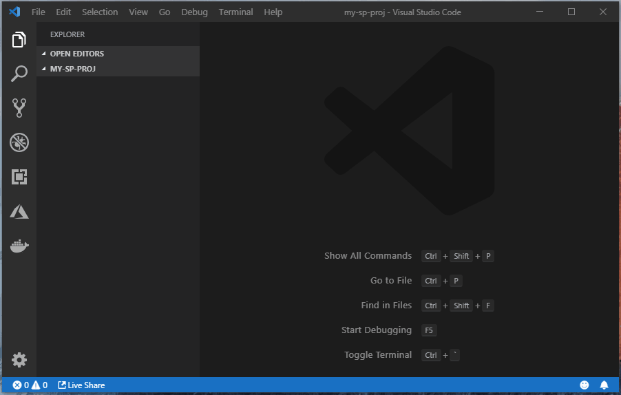
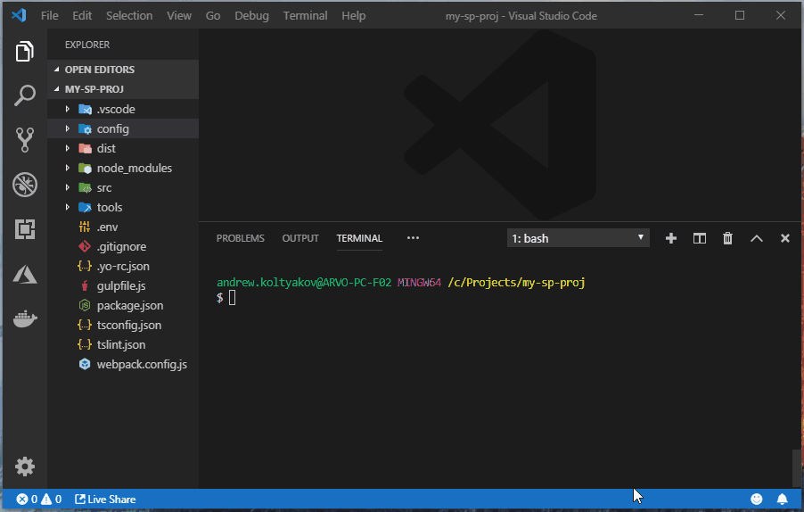
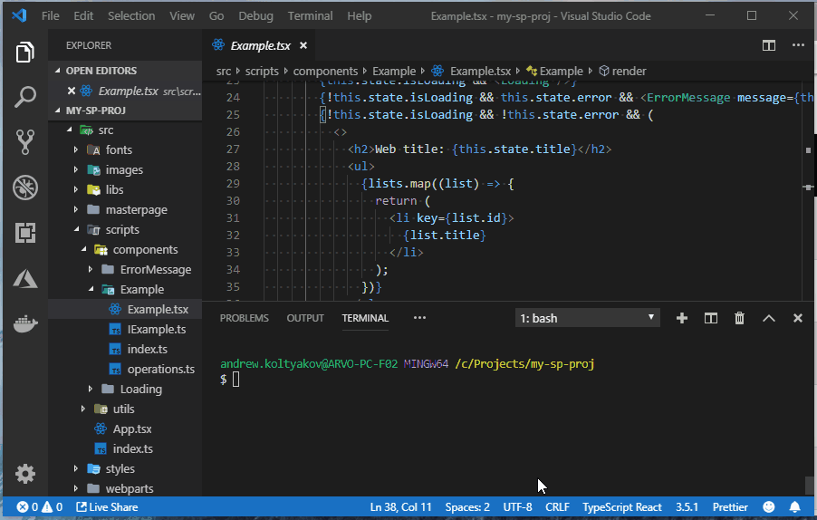

# SPPP Generator

> [Yeoman](http://yeoman.io/) generator for SharePoint client-side applications

[](https://nodei.co/npm/generator-sppp/)

[](https://badge.fury.io/js/generator-sppp)
[](https://www.npmjs.com/package/generator-sppp)

[](https://app.fossa.io/projects/git%2Bgithub.com%2Fkoltyakov%2Fgenerator-sppp?ref=badge_shield)
[](https://gitter.im/sharepoint-node/Lobby)

Yeoman generator for SharePoint - lets you quickly set up a project with sensible defaults for pulling and pushing files between SharePoint asset library and local projects sources.

Generated project allows immediately start developing SharePoint client-side solutions in Visual Studio Code or any other editor with instant publishing changes to SharePoint web site and downloading specific assets from SP Document library folder to local project assets which can be enforced with Git Diff algorithm for tracking changes.

SPPP generated projects suite perfectly for SPA development scenarious having local serve workbench with SharePoint API proxy server intergated from OOTB. Starting a local server your app refreshes instantly on changes using hot reload and incremental build at the same time the app is fully powered with real data from the API without any extra configuration.

React, PnPjs, Office UI Fabric, TypeScript, SCSS, Linting rules, polyfills, Webpack bundling, Live server, SharePoint interactive connection, [pipeline tasks](https://github.com/koltyakov/sp-build-tasks), all of these just work from the start. The batteries are included, but maybe you need congifuration changes? No problem, just override or provide yours, or extend a task, this is a part of the design.

Don't need React or Office UI Fabric? Don't worry, these guys are installed as a presets only when you decided to.

## Development scenarious

- Webparts developement
  - classic CEWPs
  - SPA applications
- Branding
  - masterpages
  - page layouts development
- Custom actions (ScriptLink User Custom Action)
- Custom scripts and portal libraries
- Custom styles
- Direct edit assets with Git backup (like in SPD days, or [SPGo](https://marketplace.visualstudio.com/items?itemName=SiteGo.spgo) but using CLI)

## Supported SharePoint versions

- SharePoint Online
- SharePoint On-Prem (2019/2016/2013)
- SharePoint 2010 (limited support)

## How to use

### Using NPX (without Yeoman and generator global installation)

Create and navigane to project folder then run:

```bash
npx -p yo -p generator-sppp -c 'yo sppp'
```

NPM v6 is required.

### Global install (classic approach)

#### Install

To use Yeoman, one need to has Node.js and NPM installed on the computer. Basic installation process description can be found in [this blog post](https://www.linkedin.com/pulse/preparing-development-machine-client-side-sharepoint-mac-koltyakov?trk=pulse_spock-articles).

Alter Node.js and NPM are staffed, install `Gulp`, `Yeoman` and `generator-sppp` globally in your Node.js environment.

```bash
npm install -g gulp-cli yo generator-sppp
```

`gulp-cli` global installation can be omitted while using NPM tasks.

#### Generate

Make a new directory or clone a blank Git project of your own and navigate to the created folder.

Inside project directory execulte:

```bash
yo sppp
```

Then follow the the Yeoman wizard instructions:



#### Package managers switch

With `--package-manager` (or `--pm`), a package manager can be selected. Possible managers are: `pnpm`, `yarm` and `npm`. `npm` is used by default and also as a fallback option.

Use `yarn`:

```bash
yo sppp --pm yarn
```

Use `pnpm`:

```bash
yo sppp --pm pnpm
```

### Define connection with SharePoint

```bash
npm run connect
```



### Dev Server & API Proxy

```bash
npm run start
```



### Sync with SharePoint

Now you can run gulp [sppull](https://www.npmjs.com/package/sppull) task:

```bash
gulp pull
```


It will deliver all files from assets folder from SharePoint to local directory.

Run npm watch task before starting editing files:

```bash
npm run watch
```

On files change they are uploaded and published to SharePoint with use of [gulp-spsave](https://www.npmjs.com/package/gulp-spsave).

For publishing files from `./dist` folder the `publish` task can be used:

```bash
npm run publish
```

### Additional Gulp tasks

Available tasks list:

```bash
gulp --tasks
```

#### Watch changes of the assets with live reload

```bash
gulp live
```

Check [sp-live-reload project page](https://github.com/koltyakov/sp-live-reload) more information.

## Tasks detail information

Please check a reference in [this wiki page](https://github.com/koltyakov/sp-build-tasks/wiki/Tasks).

## Build configuration details

SPPP is powered with `sp-build-tasks`, build configs can be found in a [wiki section](https://github.com/koltyakov/sp-build-tasks/wiki/Build-options) of the project.


## SharePoint communication layer

- [sppull](https://github.com/koltyakov/sppull) library is used for downloading files from SharePoint
- [gulp-spsave](https://github.com/s-KaiNet/gulp-spsave) library is used for saving files to SharePoint
- [sp-request](https://github.com/s-KaiNet/sp-request) and [node-sp-auth](https://github.com/s-KaiNet/node-sp-auth) are in charge for low level communication with SharePoint
- [sp-live-reload](https://github.com/koltyakov/sp-live-reload) library is used for instantaneous page reload
- [node-so-auth-config](https://github.com/koltyakov/node-so-auth-config) authentication config wizard
- [sp-build-tasks](https://github.com/koltyakov/sp-build-tasks) build tasks tool-belt

Communication layer settings are stored in `./config/private.json`, parameters settings description can be found [here](https://github.com/s-KaiNet/node-sp-auth/wiki).

## License

[](https://app.fossa.io/projects/git%2Bgithub.com%2Fkoltyakov%2Fgenerator-sppp?ref=badge_large)
